<div align="center">

<picture>
  <source media="(prefers-color-scheme: dark)" srcset="docs/brand/icon-p.svg">
  
</picture>

# Prosper

**An offline-first personal finance tracker that argues with you.**

Records a transaction in under five seconds, one hand, no network — and then
checks the entry _before_ it is saved.

[](LICENSE)


<br>

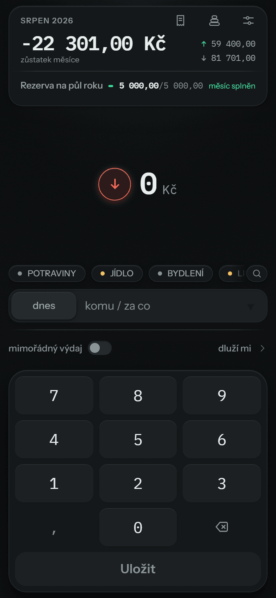
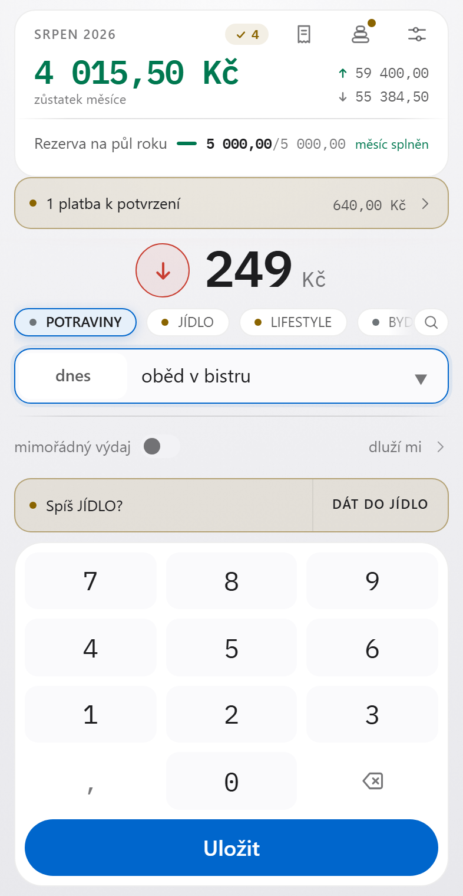
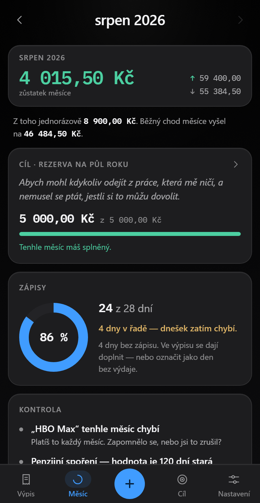

</div>

---

## Why it has opinions

Most finance apps are a form over a database. This one is built on the four laws
from _The Four Laws of Financial Prosperity_ (Blaine Harris & Charles Coonradt),
and **each law has a mechanism rather than a page of advice.** A feature that
serves no law does not get built.

| Law           | What the app actually does                                                                                                                                                                                                                                                                                            |
| ------------- | --------------------------------------------------------------------------------------------------------------------------------------------------------------------------------------------------------------------------------------------------------------------------------------------------------------------- |
| **Tracking**  | Opens straight into the keypad — no dashboard, no menu, no decision. Days with no record show as **holes** in the ledger, not as absence. A real zero is a separate, explicit mark.                                                                                                                                   |
| **Targeting** | A goal cannot be saved without a why, an amount and a date; the save button names the missing piece rather than accepting the tap and complaining. Each month gets a written commitment, and it sits on the launch screen so it cannot stop being seen.                                                               |
| **Trimming**  | Every bucket carries a `need` / `want` / `give` / `save` / `debt` type. Misfiled spending is caught **while you type**. One-off purchases are kept out of the monthly average. The month splits income the book's way — 10 % given, 10 % saved, 10 % debt or reserve, 70 % living — and names the share furthest off. |
| **Training**  | The checks run on every keystroke — a hundred small corrections, not one monthly reckoning. The goal screen keeps the record of months, ✓ or ✗ against a number you actually agreed to.                                                                                                                               |

It is written in Czech, for one person, from eight months of his own spreadsheet.
That is not an accident — it is the reason the rules are specific enough to be
worth reading.

---

## The checks are the point

Eight months of a real expense spreadsheet showed that the failure mode is not
laziness. It is **quiet miscategorisation that nobody notices until the numbers
are meaningless.**

So every rule in `lib/domain/checks.ts` exists because the spreadsheet already
went wrong that way, and each one carries the figure from the workbook in a
comment so nobody later deletes it as theoretical.

| Rule                | Catches                                                       | From the workbook                            |
| ------------------- | ------------------------------------------------------------- | -------------------------------------------- |
| `misfiled`          | Description matches a different bucket; offers it in one tap  | 25 286 Kč of food filed outside JÍDLO        |
| `unclear-number`    | Description carries a number that is not the amount           | "Netflix - 379" recorded as 74 Kč            |
| `vague`             | A large amount with a description that explains nothing       | "opak. obj", 17 074 Kč in one month          |
| `one-off`           | A large expense not yet marked extraordinary                  | a 41 890 Kč front door in with the groceries |
| `refund-as-income`  | An inflow that is really somebody paying you back             | "Zůza - bydlení plyn" booked as income       |
| `duplicate`         | Same amount and description within three days                 | HBO Max entered as −18 Kč, twice             |
| `other-overflow`    | The dumping-ground bucket past 15 % of recurring outflow      | OSTATNÍ took 100 895 Kč in eight months      |
| `missing-recurring` | A payee seen three months running, absent from this one       | a subscription cancelled, or a month missed  |
| `coverage`          | Days with no record — "your totals are lower than reality"    | the spreadsheet had no dates at all          |
| `overspend`         | The month spent more than it earned                           | four of eight months ran a deficit, silently |

**Nothing blocks a save.** A check that stops you recording an expense is worse
than the mistake it prevents.

---

## Screens

<table>
<tr>
<td width="33%" valign="top">
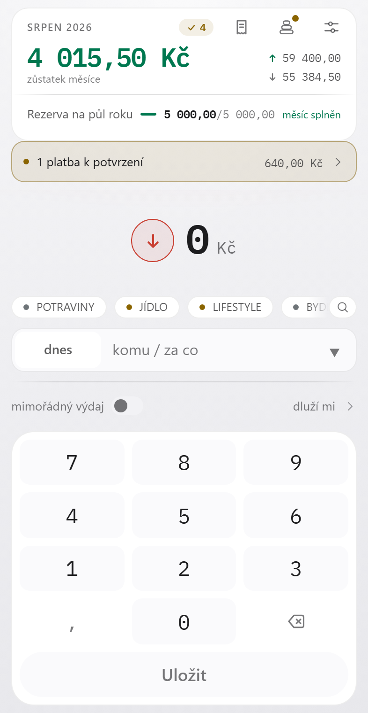
<p align="center"><b>Entry</b><br><sub>The launch route, and the only one that never scrolls. Month standing on top, then the amount in a pool of light, three most-used buckets, keypad. Three actions to a saved row.</sub></p>
</td>
<td width="33%" valign="top">
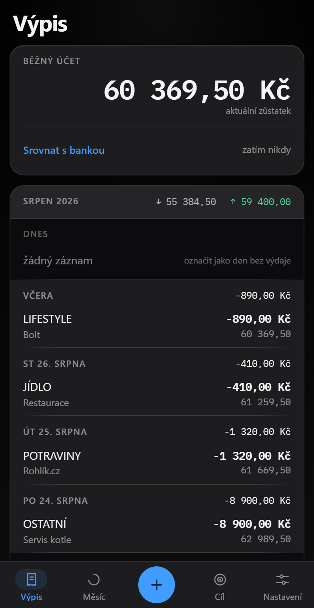
<p align="center"><b>Výpis — the tape</b><br><sub>Reverse-chronological, running balance per row, days separated by score lines, gap days rendered as holes and real zeros marked.</sub></p>
</td>
<td width="33%" valign="top">
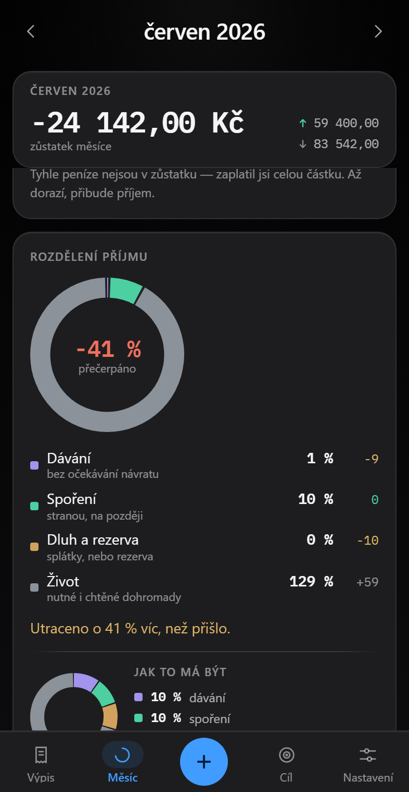
<p align="center"><b>The split</b><br><sub>10 / 10 / 10 / 70 measured against <i>income</i>, not outflow — so overspending shows as a negative remainder instead of summing to a tidy 100 %. Shown on a month that overran, because that is the only time it can say so.</sub></p>
</td>
</tr>
<tr>
<td width="33%" valign="top">
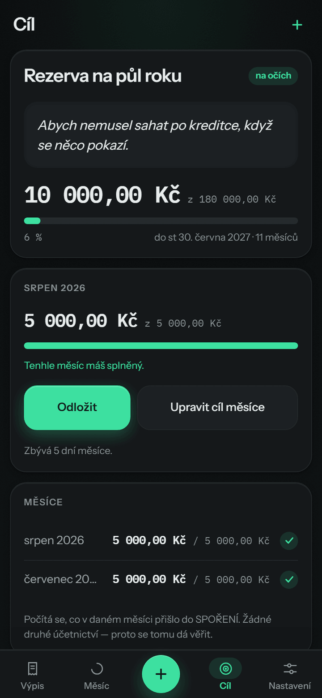
<p align="center"><b>Cíl — the goal</b><br><sub>The why in your own words, before any number. Then this month's figure, marked <i>committed</i> or merely <i>proposed</i>. Then the record of months.</sub></p>
</td>
<td width="33%" valign="top">
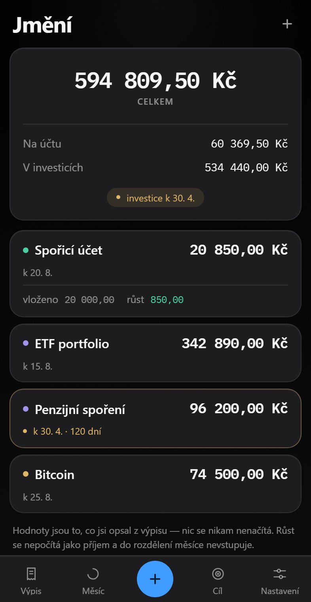
<p align="center"><b>Jmění — what it adds up to</b><br><sub>Hand-typed holding values with the day each was true. No tickers, no price feed. A reading that has gone stale raises an amber strip inside its own card. Growth is never counted as income.</sub></p>
</td>
<td width="33%" valign="top">
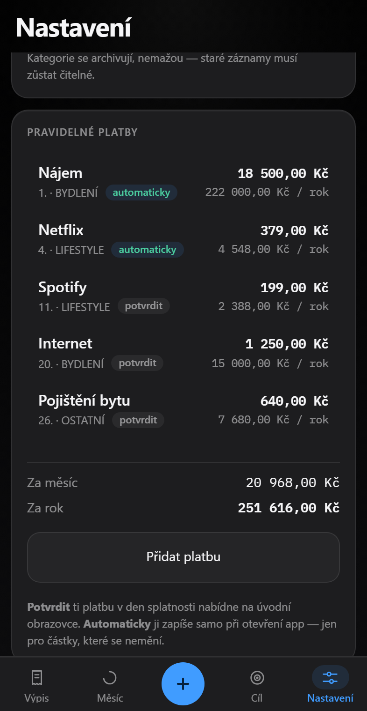
<p align="center"><b>Recurring payments</b><br><sub>Declared, not detected. Each one posts automatically or waits for one tap, with the annual cost stated where you set it.</sub></p>
</td>
</tr>
</table>

Both themes are first-class. Dark is the one it was designed for — this is an app
used one-handed, in bed, with the lights off, and its ground is true black for
exactly that reason.

---

## Run it

Requires Node 22+ and pnpm 9+ (the lockfile is v9).

```bash
git clone https://github.com/W0lf1n/Prosper.git
```

```bash
pnpm install
```

```bash
pnpm dev
```

Then <http://localhost:5173>. There is nothing else to start — no database to
provision, no API key, no `.env`. The ledger lives in IndexedDB on the device.

| Script          | What it does                                                |
| --------------- | ----------------------------------------------------------- |
| `pnpm test`     | 341 unit tests against the pure domain layer, 19 files      |
| `pnpm check`    | `svelte-check` under TypeScript strict — 0 errors           |
| `pnpm lint`     | Prettier + ESLint                                           |
| `pnpm build`    | Precompressed static output in `apps/web/build`             |
| `pnpm budget`   | The entry route against the 150 kB brotli budget, and fails over it |
| `pnpm api:test` | The sync server's 50 tests                                  |

### On the phone

The dev server is not reachable from a phone by default. Either bind it to the
network:

```bash
pnpm --filter web dev --host
```

...or serve the production build:

```bash
pnpm build && npx serve apps/web/build
```

Open the address on the phone, then Chrome menu → _Add to home screen_. The
service worker only registers over `https://` or `localhost`, so a real install
needs HTTPS.

---

## How it is built

```
apps/web/src/
├─ lib/domain/     PURE — no Dexie, no fetch, no DOM. Every rule lives here,
│                  and every rule is unit tested. This is the tested part.
├─ lib/db/         Dexie schema + migrations, and repo.ts — the only writer.
├─ lib/sync/       Outbox drain, pull, pairing. Never awaited by the UI.
├─ lib/ui/         Hand-rolled components. No component library.
├─ lib/styles/     tokens.css — the only place colour exists — and app.css,
│                  which owns .slab / .card / .meter / .btn / .field once each.
└─ routes/         / · /tape · /mesic · /cil · /jmeni · /settings

apps/api/          ASP.NET Core 9 + EF Core + Postgres 16 — optional sync server
packages/contracts The sync protocol, shared by both sides
deploy/            Compose, both nginx configs, the nightly dump
```

**One runtime dependency: Dexie.** Everything else — UUIDv7, Czech plurals, the
money type, the service worker, the XLSX writer, every component — is written
here, because every package is a bundle-size decision against a 150 kB budget.
The entry route ships **84.4 kB** of JavaScript brotli-compressed, plus 9.6 kB of
CSS, checks engine and sync layer included. `pnpm budget` fails the build if that
number ever passes 150; there is 66 kB of headroom.

A few decisions worth stealing:

- **No floating point for money.** Integer haléře, branded as `Minor`, all
  arithmetic in one module. `formatMoney` never divides the value it displays —
  it splits the integer and formats the parts, so the string is exact by
  construction rather than exact by luck.
- **Soft delete only.** No `DELETE` on user data, ever. Every row carries
  `updatedAt` / `deviceId` / `isDeleted` from day one, from before there was a
  server, because adding them later is a migration.
- **Goal progress is read off the ledger, never stored.** A contribution is an
  ordinary outflow into the goal's bucket. There is no second set of books, and
  that is the only reason the number can be trusted.
- **A stated number and a computed number never share a column.** An account
  balance is computed; a holding's value is typed in off a statement and stale
  the moment after. They are separate tables so the difference is structural
  rather than a convention someone has to remember.
- **The 10/10/10/70 split is measured against income.** A share of outflow always
  sums to 100 % and can therefore never say the one thing worth knowing.

### Sync, if you want it

Optional, and off until a device is paired. `apps/api` is an ASP.NET Core 9
service that stores each row as JSON and reasons about four fields: which
entity, which id, when it was written and by which device. It never computes a
balance and never touches money — every rule about what a transaction _means_
lives on the client, where it is tested.

Conflicts are last-write-wins on `updatedAt`, ties broken on `deviceId`. **A
delete is never undone by a merge.** The rule is written twice — once in
TypeScript, once in C# — because the two sides are two languages, and it is
tested twice for the same reason.

The client pushes before it pulls, drains its outbox oldest-first, backs off to
five minutes on failure, and never makes the UI wait for any of it.

Three containers behind one domain — the app, the sync server, Postgres — with
the client served from the API's own origin, so there is no CORS policy and the
address a device pairs against is the one it already has open:

```bash
cd deploy && cp .env.example .env && docker compose up -d --build
```

**[`docs/DEPLOYMENT.md`](docs/DEPLOYMENT.md)** is the runbook: the VPS, the
nginx vhost, the certificate, pairing the second device, and the nightly dump.

---

## Design

A system called **graphite instrument**, now in its second edition — same
instrument, calmer machining. It is not a theme layered over the app: every
colour, size and radius is a token, and the four rules below are enforced by
grep as much as by taste.

**1 · Elevation is luminance, not shadow.** A card is raised because it is
lighter than the ground, not because it throws one. Real shadow survives in
exactly two places, both of which genuinely float over content — the sheet and
the toast. Cards, buttons, the keypad shell and the tab bar all gave theirs up.

**2 · Recession is a pocket.** There is not one `inset` shadow in the app.
Inside a card, recessed is `--ground-2` and raised is `--raised`, and it steps
the right way in both themes: `#0c0c0e → #2a2a2c` dark, `#e8e8ec → #ffffff`
light. Meter tracks, field inputs, the goal's _why_ slab and the ledger's gap
days are all that same pocket.

**3 · One press, one number.** Every button presses with `scale(0.95)` over
90 ms and nothing else moves. The one exception is a full-bleed list row, which
presses by background luminance instead — scaling a 100 %-wide row by 5 % shows
the ground through its own corners.

**4 · Pill is reserved for the primary action.** `--radius-full` on a button
means "this is _the_ action". Two buttons of equal size are told apart by shape,
not by a second colour.

### Colour

**One chrome accent, and it is blue.** `--signal` is links, primary buttons, the
focus ring, the current selection and the record disc. It is never decoration
and it is never a data colour.

**Money going out has no hue at all.** `--out` is the ink. A ledger is mostly
outflow, and forty red numbers is noise rather than information — so the only
coloured number on a ledger screen is an inflow.

Data colour is the single exemption: mint for money in, amber for _look at
this_, coral for _destroy or refuse_, and four hues for the classes of the
split. All of them sit near the same lightness and chroma per theme, so no class
shouts over another, and none of them is ever re-tuned alone.

| Role                 | Dark (primary)                            | Light                                     |
| -------------------- | ----------------------------------------- | ----------------------------------------- |
| Ground → surfaces    | `#000000` → `#1d1d1f` `#252527` `#2a2a2c` | `#f5f5f7` → `#ffffff` `#fafafc` `#f2f2f5` |
| Ink                  | `#f5f5f7`                                 | `#1d1d1f`                                 |
| Signal — chrome only | `#409cff`                                 | `#0066cc`                                 |
| In · flag · danger   | `#4ccfa1` · `#dfb567` · `#ef6f5e`         | `#007850` · `#8a6400` · `#c93f32`         |

Hairlines are ink at 9 % and 16 %, never a painted grey, so they sit correctly
on every surface instead of being tuned to one. Two greps have to come back
empty: **a literal hex outside `tokens.css`**, and **`font-weight: 500`** — the
ladder is 400 / 600 / 700 and the middle weight does not exist here.

### Type

**The app ships one typeface, and it ships it for money.** Every amount is IBM
Plex Mono, tabular, right-aligned, always, so two figures in a column can be
compared without being read. That is functional first and the visual identity
second. Four woff2 files, latin + latin-ext, 57 kB self-hosted — a font CDN
would break the offline promise.

Everything that is not money is the system stack, which resolves to real SF Pro
on Apple hardware and costs nothing at all. Instrument Sans left with the second
edition, which is how a whole visual refresh landed **under** the bundle it
started from.

### The mark

<div align="center">

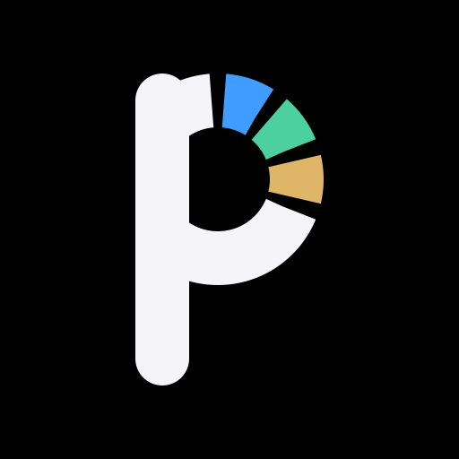
&nbsp;&nbsp;&nbsp;&nbsp;&nbsp;&nbsp;

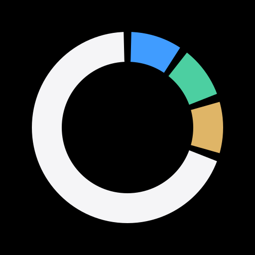
</div>

The **P** is the app logo, cut for each theme. Its bowl is not a letterform
decision — it is the 10/10/10/70 ring, drawn to the number: three arcs of a
tenth each in signal, in and flag, then seven tenths of ink, which is the
living share. The gap between segments is taken out of the share it follows,
so the four still sum to the whole circle. The stem is the only thing added to
make it read as a letter, and it is what the ring is clipped against.

The **ring alone** is the same geometry with the stem taken off. It has no
assigned use yet and is parked here until it earns one.

Six files — a light and a dark cut of each, plus a `currentColor` cut of each
that takes the colour of whatever it is placed in. All of them are stroked
arcs on one circle, expressed as `stroke-dasharray` against the circumference,
so the split is legible in the source rather than baked into path data. Under
a kilobyte apiece, and nothing to rasterise.

---

## Status

**Offline-first, and the server is optional.** The app is fully functional with
the network permanently down, and a device that has never been paired never
queues a row or makes a request. Sync adds a second copy and a merge point
between two devices; it does not become the ledger.

| Phase                             | State                                                 |
| --------------------------------- | ----------------------------------------------------- |
| P0 · Foundation                   | ✅ shipped                                            |
| P1 · MVP, local only              | ✅ shipped — six screens, checks, PWA                 |
| Targeting · goals                 | ✅ shipped ahead of schedule                          |
| Investments · `/jmeni`            | ✅ shipped, items 5–8 outstanding                     |
| Recurring payments                | ✅ shipped                                            |
| P2 · Sync                         | ✅ shipped — protocol, engine, pairing, and `deploy/` |
| Design · second edition           | ✅ shipped — tokens, all six screens, one font fewer  |
| P3 · Caps, close ritual, nudge    | designed, not built                                   |
| P4 · Bank import · P5 · Reporting | not started                                           |

Schema **v6**, backup format **5**. `deploy/` is written but has never been run
against real Docker or real Postgres — treat the runbook as unproven until a VPS
answers `{"ok":true}`.

The next step is not more code. It is **fourteen consecutive days of real use** —
because real usage will invalidate a meaningful share of the P3 assumptions, and
it is cheaper to learn that first.

**[`docs/TODO.md`](docs/TODO.md) is the single list of everything unfinished**,
including the handful of defects worth fixing regardless of that gate.

---

## Documentation

These are unusually complete, and deliberately so — the reasoning is the
valuable part, not the code.

| Document                                                                                    | What it is                                                           |
| ------------------------------------------------------------------------------------------- | -------------------------------------------------------------------- |
| [`docs/PROJECT-PLAN.md`](docs/PROJECT-PLAN.md)                                              | The specification, describing the app **as it stands**. Binding      |
| [`docs/DECISIONS.md`](docs/DECISIONS.md)                                                    | Every answered question, every deviation, every rejected alternative |
| [`docs/TODO.md`](docs/TODO.md)                                                              | The only list of unfinished work                                     |
| [`docs/TRIMMING-AND-TRAINING.md`](docs/TRIMMING-AND-TRAINING.md)                            | Laws 3 and 4 — design for what is not built yet                      |
| [`docs/INVESTMENTS.md`](docs/INVESTMENTS.md)                                                | `/jmeni` — the model, and why growth is not income                   |
| [`docs/RECURRING.md`](docs/RECURRING.md)                                                    | Declared recurring payments                                          |
| [`docs/DEPLOYMENT.md`](docs/DEPLOYMENT.md)                                                  | Running it on a VPS — Docker, nginx, TLS, backups                    |
| [`docs/design_handoff_prosper_visual_refresh/`](docs/design_handoff_prosper_visual_refresh/) | The second edition as delivered — tokens, four patches, previews     |
| [`CLAUDE.md`](CLAUDE.md)                                                                    | Working rules, and the traps this codebase already fell into         |

`DECISIONS.md` is worth a look even if you never run the app. It records what an
ordinary household spreadsheet got wrong over eight months, in figures — and
what a piece of software can do about each one.

---

## Contributing

This is a personal app that happens to be readable, not a product looking for
users. Issues and questions are welcome; large feature pull requests probably
are not, because the non-goals list in `PROJECT-PLAN.md` §3 is binding and most
new ideas land on it.

If you do send a patch: `pnpm test`, `pnpm check` and `pnpm lint` all have to
pass, the domain layer stays pure, and a new rule gets a test before it gets a
screen.

## License

[MIT](LICENSE) © Petr Boháč
